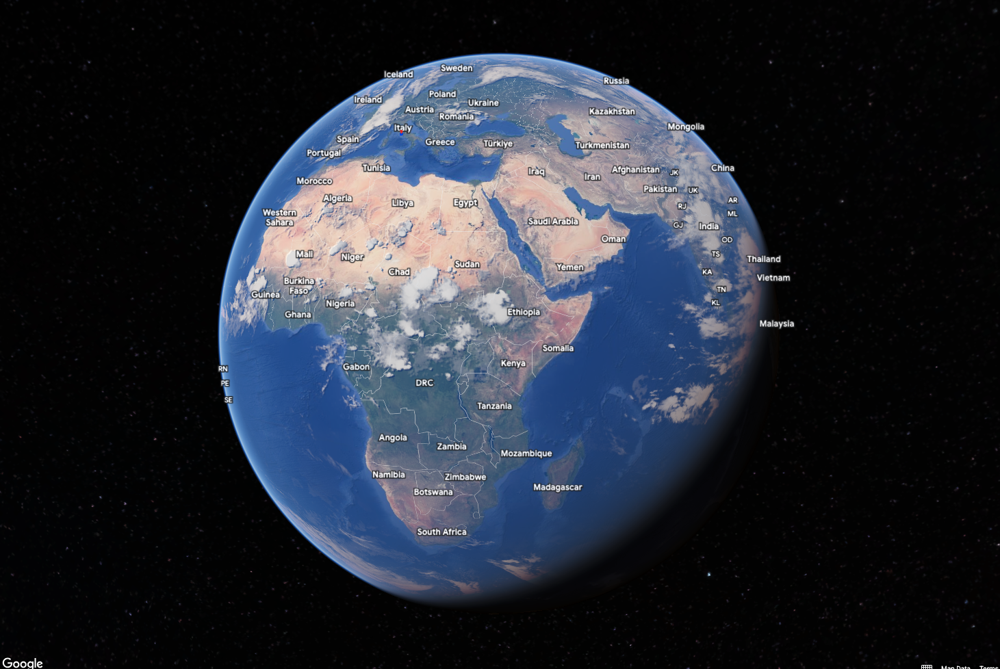
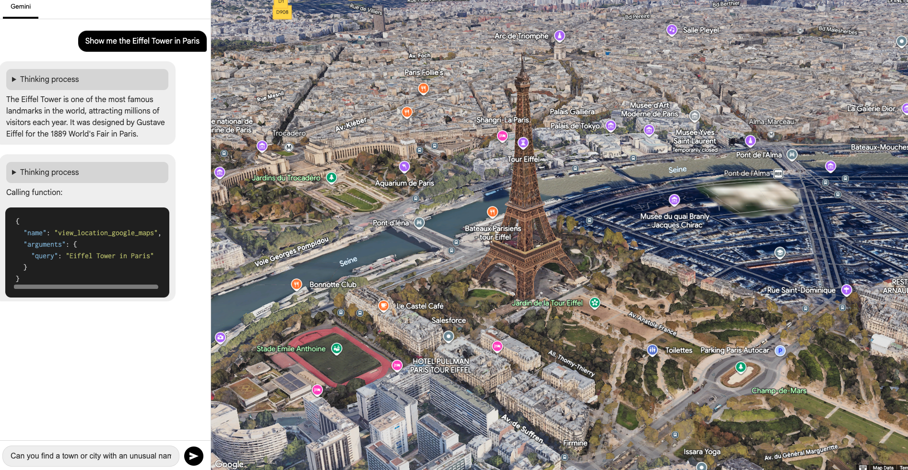
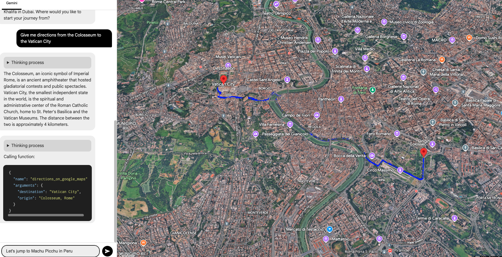

<p align="center">
  
  <h2 align="center">MCP Maps 3D - A Conversational 3D Globe</h2>
  <p align="center">Explore a photorealistic 3D model of the Earth using natural language commands, powered by Google Gemini and the Model Context Protocol (MCP).</p>
</p>

<p align="center">
  
  
  
  
  
</p>

<p align="center">
  <a href="#">View Live Demo (Coming Soon)</a> ·
  <a href="https://github.com/dave21-py/mcp-maps-3d/issues">Report Bug</a> ·
  <a href="https://github.com/dave21-py/mcp-maps-3d/issues">Request Feature</a>
</p>

---

## ✨ Overview

MCP Maps 3D is an interactive web application that showcases the power of combining large language models with real-world tools. It leverages the **Google Maps Photorealistic 3D Tiles API** to render a stunning, high-fidelity model of the entire globe.

The core of the project is a conversational interface powered by the **Google Gemini API**. Users can type natural language commands—from asking to see famous landmarks to requesting complex driving directions—and watch as the AI interprets their request and manipulates the map in real-time.

This is made possible by the **Model Context Protocol (MCP)**, which acts as a robust bridge, allowing the Gemini model to reliably call and execute custom "tools" that control the map's functions.

*   **Conversational Map Control:** Simply tell the AI what you want to see. No complex menus or buttons.
*   **Photorealistic 3D Globe:** Navigate the entire world in stunning, high-resolution 3D, from a global view down to individual buildings.
*   **AI-Powered Tool Usage:** The AI has access to two primary functions:
    *   `view_location`: Geocodes a text query to find its latitude and longitude, then flies the camera to that point.
    *   `directions`: Calculates a route between an origin and destination and draws it on the map.
*   **Powered by MCP:** Demonstrates a clean and effective implementation of the Model Context Protocol for connecting an AI model to a frontend application's tools.

---
## ✨ Demo

Prompt 1
<p align="center">
  
</p>

Prompt 2
<p align="center">
  
</p>

---


## 🚀 Getting Started

To get a local copy up and running, follow these simple steps.

### Prerequisites

*   You must have [Node.js](https://nodejs.org/) installed on your computer (which includes npm).

### Installation

1.  **Clone the repo**
    ```bash
    git clone https://github.com/dave21-py/mcp-maps-3d.git
    ```
2.  **Navigate to the project directory**
    ```bash
    cd mcp-maps-3d
    ```
3.  **Install NPM packages**
    This will download all the necessary libraries for the project.
    ```bash
    npm install
    ```
4.  **Set up API Keys**
    The project requires API keys for Google Gemini and Google Cloud Platform.
    *   Create a new file in the root of the project named `.env`
    *   Add your API keys to this file in the following format:
        ```
        # .env file
        VITE_GEMINI_API_KEY="YOUR_GOOGLE_GEMINI_API_KEY"
        VITE_GOOGLE_MAPS_API_KEY="YOUR_GOOGLE_MAPS_API_KEY"
        ```
5.  **Run the project**
    This command starts the local development server.
    ```bash
    npm run dev
    ```
    Then, open your browser and navigate to the local URL provided (usually `http://localhost:5173`).

---

## 🛠️ Tech Stack

*   **Frontend:** [Lit](https://lit.dev/), [TypeScript](https://www.typescriptlang.org/), [Vite](https://vitejs.dev/)
*   **AI & APIs:**
    *   [Google Gemini API](https://ai.google.dev/)
    *   [Google Maps JavaScript API](https://developers.google.com/maps/documentation/javascript) (including Photorealistic 3D, Geocoding, and Directions APIs)
*   **Protocol:**
    *   [Model Context Protocol (MCP)](https://github.com/model-context/protocol)

---

## 🌐 Deployment

This project is a static web application and can be easily deployed on platforms like **GitHub Pages**, **Vercel**, or **Netlify**.

When deploying, ensure you use your platform's system for managing environment variables (often called "secrets") to store your `VITE_GEMINI_API_KEY` and `VITE_GOOGLE_MAPS_API_KEY` securely. **Do not commit your `.env` file to your repository.**

---

## 🙌 Contributing

Contributions, issues, and feature requests are welcome! Feel free to check the [issues page](https://github.com/dave21-py/mcp-maps-3d/issues).

Would love to hear your guys feedback on this project, also dont forget to connect with me on linkedIn: https://www.linkedin.com/in/david-geddam/


